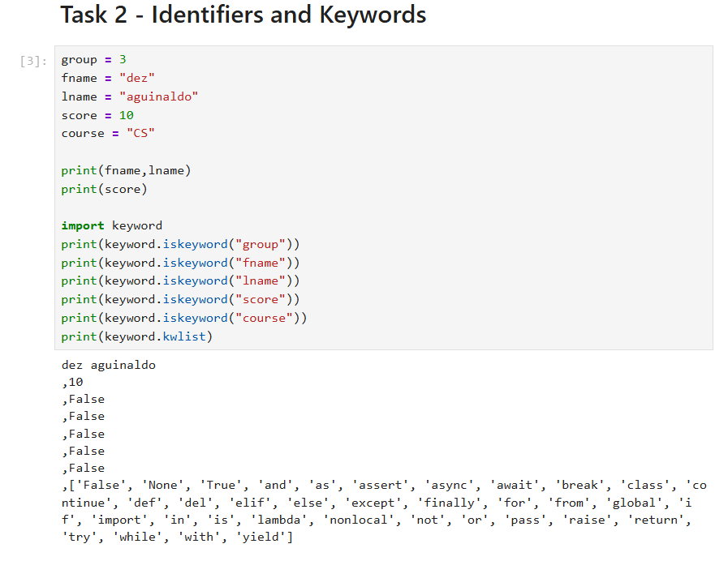
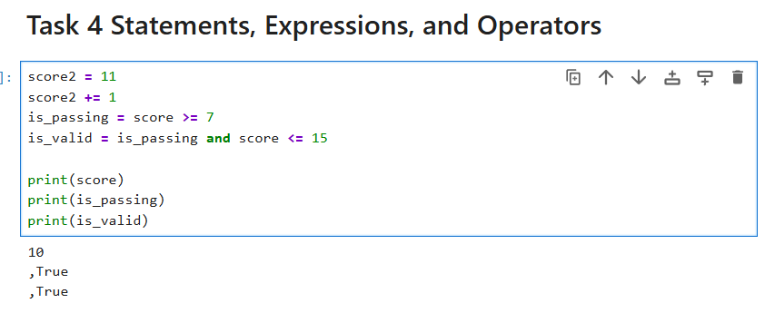
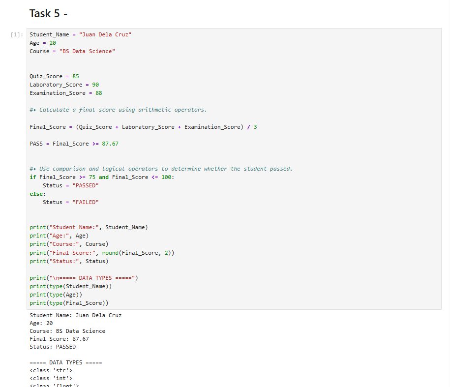

# Python Fundamentals Laboratory 1 - Group 3

## Laboratory Title

**Getting Started with Python: Environment Setup, Python Fundamentals, and GitHub Collaboration**

---

## Group Information

**Group 3**

| Member | GitHub Username |
|--------|----------------|
| Aguinaldo, Vaughn Dezler | melterefic |
| Camacam, Rapha-el | — |
| Dela Cruz, Prince Kyle | FENRIR315 |
| Ricio, Jan Carlo | — |

**Assigned Roles**

- **GitHub Repository / Collaboration:** FENRIR315
- **Member:** melterefic
- **Other group members:** Aguinaldo, Vaughn Dezler; Camacam, Rapha-el; Dela Cruz, Prince Kyle; Ricio, Jan Carlo

---

## Python Environment

**Python Version:** 3.13.5 | packaged by Anaconda, Inc. | (main, Jun 12 2025, 16:37:03) [MSC v.1929 64 bit (AMD64)]

**Jupyter Environment:** The laboratory activities were performed using **Jupyter Notebook** through the Anaconda Python environment.

---

## Laboratory Activity Description

This laboratory activity introduced the fundamentals of Python programming while providing hands-on experience with setting up a Python environment, working with Jupyter Notebook, understanding Python syntax and data types, using operators, and collaborating through GitHub.

The activity also involved developing and debugging a **Student Performance Analyzer** program.

---

## Laboratory Tasks

### Task 1 - Python Environment and Jupyter

The first task focused on setting up the Python programming environment and using Jupyter Notebook to execute Python code. The group verified that Python was installed correctly and that the Jupyter environment could successfully execute Python programs.

---

### Task 2 - Identifiers and Keywords

This task focused on Python identifiers and keywords.

**Q: What is an identifier in Python, and why must keywords not be used as identifiers?**

Identifiers are names given to variables, functions, classes, and other objects in a Python program. They make it easier for programmers to identify and work with values. Keywords are reserved words that have special meanings in Python. They cannot be used as identifiers because Python uses them as part of its programming syntax. Using a keyword as an identifier can result in a syntax error.

---

### Task 3 - Variables, Dynamic Typing, and Data Types

This task introduced variables, dynamic typing, and Python data types.

**Q: What does dynamic typing mean in Python?**

Dynamic typing means that a variable is not permanently restricted to one data type. Its type is determined by the value currently assigned to it. For example, a variable can initially contain an integer and later be assigned a string.

**Q: What is the purpose of `type()`?**

The `type()` function is used to determine the data type or class of an object or value in Python.

---

### Task 4 - Operators

This task focused on using Python operators to perform calculations and comparisons.

**Q: How did operators help your team build the Student Performance Analyzer?**

Operators were essential in creating the grading and analysis system. Arithmetic operators were used to calculate the student's final score, while comparison and logical operators were used to determine the student's status based on the calculated score. Without operators, the Student Performance Analyzer would not be able to accurately calculate and evaluate the student's performance.

---

### Task 5 - Student Performance Analyzer

The final task involved creating and debugging a **Student Performance Analyzer**. The program calculates the student's final score based on quiz, laboratory, and examination scores and determines the student's performance status.

**Code Corrections:**

1. Changed colons (`:`) to equal signs (`=`) for variable assignments
2. Corrected capitalization errors in variable names
3. Fixed indentation issues
4. Corrected inconsistent variable naming
5. Added an `else` statement so that the `status` variable is always defined
6. Corrected the calculation and comparison logic used to determine the student's final status

After these corrections, the Student Performance Analyzer successfully executed and produced the expected output.

---

## Key Questions and Answers

**1. What is an identifier in Python, and why must keywords not be used as identifiers?**

Identifiers are names used to identify variables, functions, classes, and other objects in Python. Keywords are reserved words with special meanings in Python, so they cannot be used as identifiers because doing so would interfere with Python's syntax and cause errors.

**2. What is the difference between a statement and an expression?**

A **statement** is an instruction that performs an action in a Python program, while an **expression** is a piece of code that produces a value. An expression can also be part of a larger statement.

**3. What does dynamic typing mean in Python?**

Dynamic typing means that variables do not need to be explicitly assigned a data type. Python determines the type based on the value assigned to the variable, and the variable can later refer to a value of a different type.

**4. How did operators help your team build the Student Performance Analyzer?**

Operators allowed the program to calculate the student's final score and evaluate the student's performance. Arithmetic operators were used for calculations, while comparison and logical operators were used to determine the student's status.

**5. What is the purpose of `type()`?**

The `type()` function determines the data type or class of an object or value.

**6. How did GitHub help your group collaborate on the laboratory activity?**

GitHub made it easier for the group to manage and organize project files while allowing members to collaborate on the same repository. It also provided version control, making it possible to track changes and revert mistakes when necessary.

---

## Student Performance Analyzer

The **Student Performance Analyzer** is a Python program designed to calculate and evaluate a student's academic performance. The program uses the student's:

- Quiz Score
- Laboratory Score
- Examination Score

These scores are used to calculate the student's final score. The program then evaluates the result using conditional statements to determine the student's performance status.

The original program contained several syntax and logic errors. These were corrected by:

1. Replacing colons with equal signs for variable assignment
2. Correcting capitalization errors
3. Fixing indentation
4. Correcting inconsistent variable names
5. Adding an else statement to ensure that the status variable is always assigned a value
6. Correcting the grading and evaluation logic

After these corrections, the Student Performance Analyzer successfully executed and produced the expected output.

---

## Repository

**GitHub Repository:** [FENRIR315/python-fundamentals-lab1-group3](https://github.com/FENRIR315/python-fundamentals-lab1-group3)

---

*Group 3 - Python Fundamentals Laboratory 1*
